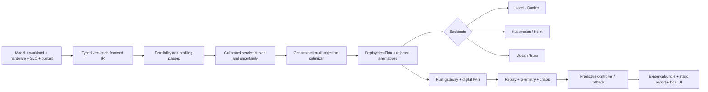
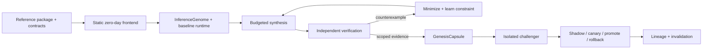
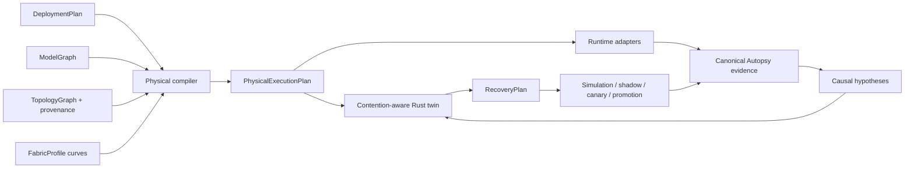

# SLOForge

SLOForge is an SLO-driven inference deployment compiler and adaptive runtime. It turns a typed model, workload, hardware catalog, price, profiling budget, and latency/goodput/availability constraints into a versioned `DeploymentPlan`, an uncertainty-aware Pareto frontier, deployable artifacts, and a hash-bound `EvidenceBundle`.

It is not an LLM proxy or a YAML generator. The compiler performs memory feasibility pruning, measured hardware and engine profiling, service-curve calibration, budgeted candidate search, topology/routing/admission/autoscaling lowering, deployment validation, replay, fault injection, and evidence-backed reporting. Modal and Baseten Truss are optional output targets; the local compiler, Rust simulator, and Rust gateway have no cloud dependency.

## Architecture



Python owns profiling orchestration, statistical models, optimization, control experiments, diagnosis, lowering, and reports. Rust owns the asynchronous streaming data plane, bounded telemetry, load generation, and deterministic discrete-event simulation. Their primary boundary is canonical JSON over a stable subprocess protocol: it is debuggable, language-neutral, and keeps a Python crash outside the latency-sensitive gateway process. See [Architecture](docs/ARCHITECTURE.md) and [ADR 0001](docs/adr/0001-rust-python-boundary.md).

## SLOForge Genesis

Genesis extends the existing compiler from choosing a known deployment configuration to synthesizing
a scoped inference-serving implementation. Its inputs are a typed reference package, workload,
hardware/fabric contract, semantic and quality contracts, SLOs, an explicit seed, and a finite budget.
Its output is an eight-region `InferenceGenome`, a generated conservative runtime, typed
transformations and policies, independently checked evidence, a rejected-candidate corpus, lineage,
and a hash-addressed `GenesisCapsule`. Generated source and proposal scores never authorize
deployment.



The static frontend deliberately does not turn Python source order into a guessed algebraic graph. It
recovers a typed call and state inventory, but records unresolved SSA input/output bindings and tensor
metadata as `unresolved_static_call_inventory`; tensor rewrites over those calls remain disabled until
an export-backed or otherwise proven graph supplies those bindings. The generated baseline instead
executes declared reference entry points with bounded queues, deterministic seeds, streaming events,
cancellation checks, request-owned state, and clean shutdown.

The artifact-backed CPU demonstration is:

```console
make genesis-demo
make synthbench-smoke
```

It produces `artifacts/genesis/demo/GENESIS_DEMO_REPORT.json` and
`artifacts/synthbench/smoke/run/report.json`. The flagship run executes a real unsafe
cancellation-policy candidate, minimizes the witness to `admit, cancel, emit`, learns a reusable
`cancel_check_before_emit` precondition, and accepts a corrected candidate that changes both request
and serving regions. It then builds two separate capsules from independently synthesized candidates,
registers the second as an isolated challenger, runs deterministic local shadow/canary gates,
revalidates immediately before promotion, and proves in the fixture that an already visible stream
remains leased to its original capsule. The later fabric-degradation trigger is simulated, not a
physical-link experiment.

Capsule validation requires trust material from outside the untrusted capsule tree:

```console
sloforge genesis capsule validate artifacts/genesis/manual-73129/capsule \
  --context artifacts/genesis/manual-73129/operator-trust/validation_context.json \
  --expected-digest "$EXPECTED_CAPSULE_DIGEST"
```

The operator-controlled context pins model, tokenizer, workload, hardware, dependency lock, verifier
version, evidence-record issuers, and exact artifact digests. SHA-256 provides content identity, not
signer authentication; production use must distribute the expected digest and evidence anchors over
a trusted channel. The CLI rejects a context stored inside the capsule itself. See the exact
[CPU demo and validation procedure](docs/genesis/DEMO_SCRIPT.md), [capsule format](docs/genesis/GENESIS_CAPSULE.md), and [trust model](docs/genesis/TRUST_MODEL.md).

ServingSynthBench's CPU smoke mode uses seeded randomized model grammars, evaluator-only hidden cases,
raw timing samples, randomized run order, and artifact-derived metrics. These timings exercise the
harness; they are not GPU or production serving results. The multi-seed Genesis evaluation is honest
about the evidence boundary: H2 (whole-stack performance), H4 (Autopsy-guided search efficiency), and
H5 (lineage transfer efficiency) remain unevaluated campaigns, while the local controller and
cross-layer candidate results are only scoped or partial evidence.

On the checked Darwin host, the macOS sandbox path was exercised. NVIDIA GPU/Triton execution,
multi-GPU/multi-node execution, Linux bubblewrap isolation, Docker-daemon smoke, paid synthesis,
external traffic, and live promotion were not exercised and are never inferred from adapters or
synthetic evidence. The macOS backend cannot enforce a hard address-space limit, so memory-hostile
code still requires an outer VM/container boundary. Detailed scope and open hazards are in
[Genesis limitations](docs/genesis/LIMITATIONS.md), [security](docs/genesis/SECURITY.md), and the
[adversarial review](docs/genesis/RED_TEAM_REVIEW.md). The paper-style system report is
[paper/genesis/README.md](paper/genesis/README.md), and the literature/claim boundary is
[docs/GENESIS_RELATED_WORK.md](docs/GENESIS_RELATED_WORK.md).

## SLOForge Fabric

Fabric extends the logical compiler into a topology-aware physical execution compiler and self-healing multi-node runtime. It maps tensor, pipeline, data, and expert-parallel ranks onto concrete hosts, GPUs, NUMA domains, NICs, and rails; lowers collectives and KV transfers onto measured paths; validates the resulting `PhysicalExecutionPlan` in a deterministic communication-aware Rust twin; and binds every decision to canonical evidence hashes.



Autopsy is a structured causal debugger, not an LLM wrapper. It aligns cross-host clocks with explicit uncertainty, matches identical event/operation/rank/request identities, scores supporting and contradicting evidence, removes each suspected cause in the digital twin, and records why alternatives were rejected. The recovery controller cannot mutate production by default: disruptive proposals must pass simulation, shadow, minimum-sample canary, promotion, drain, and rollback guards.

The complete no-GPU path is reproducible locally:

```console
make fabric-check
make fabric-demo
make autopsy-demo
make forgeci-demo
make warmpath-demo
make extension-evaluation
```

`make fabric-demo` uses an explicit synthetic two-host/eight-GPU-per-host topology with NUMA domains, PCIe/NVLink contention domains, two network rails, MoE expert placement, disaggregated prefill/decode workers, and calibrated synthetic link curves. It starts the real Rust gateway, replays streaming traffic, injects a rail degradation and rank-local GPU slowdown, captures canonical evidence, evaluates counterfactual repairs, and executes the selected recovery through shadow and canary promotion. Its static report and UI reject missing or hash-mismatched artifacts.

The same workflow is exposed through the CLI:

```console
sloforge fabric discover --fixture two_node_infiniband \
  --output artifacts/fabric/topology.json
sloforge fabric benchmark --topology artifacts/fabric/topology.json --suite full --synthetic \
  --output artifacts/fabric/measurements
sloforge fabric model inspect --model synthetic --synthetic-moe \
  --output artifacts/models/model-graph.json
sloforge fabric compile --deployment-plan artifacts/plans/current.json \
  --topology artifacts/fabric/topology.json \
  --fabric-profile artifacts/fabric/measurements/fabric-profile.json \
  --model-graph artifacts/models/model-graph.json \
  --slo 'p95_ttft_ms<=250,p99_tpot_ms<=45' \
  --output artifacts/physical-plans/plan.json
sloforge fabric simulate --plan artifacts/physical-plans/plan.json \
  --topology artifacts/fabric/topology.json \
  --fabric-profile artifacts/fabric/measurements/fabric-profile.json \
  --trace workloads/mixed-bursty.jsonl --output artifacts/simulations/run-001
sloforge autopsy diagnose artifacts/autopsy/degraded-run.json \
  --baseline artifacts/autopsy/healthy-run.json \
  --output artifacts/autopsy/diagnosis.json
sloforge recovery plan --diagnosis artifacts/autopsy/diagnosis.json \
  --physical-plan artifacts/physical-plans/plan.json \
  --output artifacts/recovery/proposal.json
sloforge recovery apply --proposal artifacts/recovery/proposal.json --mode shadow-canary
```

ForgeCI uses repeated trials, bootstrap intervals, an explicit noise floor, practical significance, inconclusive classification, and a portable fixture repository to validate performance bisection without external projects. WarmPath profiles a real local artifact DAG and chooses among storage, cache, host-memory, lazy-restore, and warm-capacity strategies under readiness, cost, compatibility, capacity, and failure constraints.

The checked CPU-only Fabric evaluation retains negative results. Across 180 synthetic plan trials (four topology fixtures, three workload regimes, three seeds, and five methods), sequential placement was fastest at 616.428 ms median p95 TTFT; the hierarchical compiler reached 626.068 ms, 1.56% slower. Random placement reached 2831.615 ms with 43.75% median SLO attainment, while the topology-unaware joint optimizer reached 1015.728 ms. This fixture therefore does not support H1 against an already topology-aligned sequential order. The internally calibrated twin ranked alternatives with Spearman 0.993, 0.0284% median relative error, 16.295 ms mean absolute error, 73.33% prediction-interval coverage, and 1.003% Pareto-selection regret. Coverage fell to 20% for the expert-skewed workload, and compiler predictions share synthetic calibration inputs with the twin, so these are not independent hardware-accuracy results. Autopsy reached top-1/top-3 accuracy 1.0 over 24 deterministic cases from two fault families; its 0.925 median confidence is an uncalibrated evidence score. Diagnosis-driven and threshold recovery both restored 100% of those modeled cases; their 90.5 s/$0 and 60 s/$0.0667 medians use declared action-time/cost policies, with post-action requests simulated rather than live. Full inputs, intervals, and caveats are in [the Fabric evaluation](reports/fabric-evaluation.md), [the Autopsy/recovery evaluation](reports/autopsy-evaluation.md), and `artifacts/fabric/evaluation/result.json`.

On this checked-in development host, topology discovery and local memory profiling are hardware-backed, but NVIDIA GPU, NVLink, NCCL, RDMA, InfiniBand/RoCE, and multi-node runtime execution are unavailable. Those adapters are version-gated and fixture-tested; the repository does not present synthetic measurements as hardware results. See the [Fabric architecture](docs/fabric/ARCHITECTURE.md), [Autopsy diagnosis model](docs/autopsy/DIAGNOSIS.md), [recovery safety model](docs/recovery/SAFETY.md), [Fabric limitations](docs/FABRIC_LIMITATIONS.md), and [extension report](paper/fabric_extension/SLOFORGE_FABRIC.md).

Runtime lowering is deliberately fail closed. Direct vLLM and SGLang plans reject replicas spanning hosts; tagged NVIDIA Dynamo v1beta1 DGD is the supported multi-node engine path. vLLM expert parallelism must match the runtime TP-by-DP product, SGLang expert parallelism never implicitly enables DP attention, native vLLM NIXL transfer flags remain separate from Dynamo wrapper flags, and generic Kubernetes multi-node export is rejected without an atomic gang contract. Modal and Truss receive advisory metadata only. Exact reviewed versions, fields, and unexercised boundaries are in [Runtime adapters](docs/fabric/RUNTIME_ADAPTERS.md) and [the adapter review](RUNTIME_ADAPTER_REVIEW.md).

## Three-minute CPU quickstart

Prerequisites are Python 3.11+, [uv](https://docs.astral.sh/uv/), Rust 1.93.1, and Node 22. Node is only used by the local artifact UI, but the full repository `bootstrap` and `check` targets include that UI. No NVIDIA GPU, model download, cloud account, or credentials are needed.

```console
make bootstrap
source .venv/bin/activate
make check
make demo
```

The demo starts three real Rust mock-server processes with distinct service curves, profiles them over HTTP/SSE, calibrates the digital twin, searches 540 configurations under a 24-proposal budget, preserves only the three exactly profiled shapes as measured anchors, emits a plan and Pareto set, starts the real Rust gateway, replays 120 streaming requests, injects slowdown/crash/cold-start faults, evaluates both controller policies in the calibrated Rust twin, and creates all five deployment targets.

The primary outputs are:

- `artifacts/demo/plans/qwen3-coding-agent.json`
- `artifacts/demo/evidence/evidence.json`
- `artifacts/demo/profiles/qwen3-cpu-mocks/measurements.jsonl`
- `artifacts/demo/simulator/replay.json` and `trace.json`
- `artifacts/demo/gateway/replay.json` and `metrics.prom`
- `artifacts/demo/benchmarks/serving-baselines.json`
- `reports/demo/evaluation.md`, `evaluation.html`, and `report-data.json`

The report generator verifies every indexed SHA-256 digest, reconciles the `EvidenceBundle` hash chain, and verifies the plan's canonical digest before reading metrics. It refuses tampered or internally stale input, so report values cannot drift away from the raw run silently.

## Cohesive CLI workflow

```console
sloforge trace validate workloads/coding-agent.jsonl
sloforge hardware probe --device cpu --output artifacts/hardware/local.json

sloforge profile \
  --model sloforge/mock-qwen3-0.6b-shape \
  --engines mock \
  --hardware artifacts/hardware/local.json \
  --trace workloads/coding-agent.jsonl \
  --budget-usd 0.20 \
  --output artifacts/profiles/local

sloforge optimize \
  --profile artifacts/profiles/local \
  --slo 'p95_ttft_ms<=250,p99_itl_ms<=45' \
  --objective minimize:cost_per_million_tokens \
  --output artifacts/plans/local.json

sloforge explain artifacts/plans/local.json
sloforge replay --plan artifacts/plans/local.json --trace workloads/coding-agent.jsonl
sloforge chaos --scenario scenarios/cpu-demo.yaml
sloforge export --plan artifacts/plans/local.json --target kubernetes --output generated/k8s
sloforge report \
  --evidence artifacts/demo/evidence \
  --artifact-index artifacts/demo/evidence/artifact-index.json \
  --output reports/local
```

An optimization result identifies the chosen non-dominated candidate, its fidelity (`measured` only for an exactly executed profile shape; otherwise `predicted`), uncertainty-adjusted constraint margins, the budgeted proposal history, and every rejected candidate with reason codes. `sloforge explain` names the dominant measured/modelled bottleneck and links back to evidence.

## GPU profiling

The default open-weight path is `Qwen/Qwen3-0.6B`, whose resolved immutable revision, safetensors checksum, parameter count, context limit, and Apache-2.0 license metadata are captured at profiling time. A CUDA probe never falls back to CPU and requires an explicit hourly price; zero is valid for owned hardware.

```console
uv sync --locked --extra dev --extra gpu-transformers
sloforge hardware probe \
  --device cuda \
  --hourly-price-usd 0 \
  --output artifacts/hardware/gpu.json

sloforge profile \
  --model Qwen/Qwen3-0.6B \
  --engines transformers,vllm,sglang \
  --hardware artifacts/hardware/gpu.json \
  --trace workloads/coding-agent.jsonl \
  --budget-usd "${SLOFORGE_GPU_BUDGET_USD:-0}" \
  --output artifacts/profiles/qwen3-gpu
```

Install the separate `gpu-vllm` and `gpu-sglang` extras in engine-compatible environments when those servers are requested. The Transformers path is the direct correctness baseline; vLLM and SGLang use managed OpenAI-compatible servers. TensorRT-LLM is isolated behind its optional adapter. Torch Perfetto traces, bounded server logs, package/CUDA metadata, and generated Nsight commands are retained. `make benchmark-gpu` records an explicit unavailable artifact rather than numbers when no NVIDIA device exists.

The Triton fused logits experiment is opt-in and never selected automatically at runtime. Its isolated-kernel claim gate requires randomized interleaved trials whose lower paired bootstrap bound exceeds a 10% practical threshold; that does not establish end-to-end serving benefit:

```console
uv run python benchmarks/gpu/benchmark_fused_logits.py \
  --device cuda --enable-triton-experiment \
  --output artifacts/gpu/fused-logits.json
```

## Gateway and controller

The Axum/Tokio gateway exposes OpenAI-compatible completion and chat paths with streaming SSE, bounded admission and stream buffers, cancellation propagation, pre-output-only retry, health checks, circuit breakers, four routing policies, structured errors, Prometheus metrics, and Chrome traces. Its contract suite covers partial output, malformed SSE, slow consumers, disconnects, saturation, retries, active health removal/restoration, and client-drop cancellation.

The controller records observations, drift forecast, all evaluated actions, safety guards, chosen action, canary state, observed outcome, and rollback reason. Minimum samples, hysteresis, cooldowns, and hourly change budgets prevent oscillation. A targeted test forces a materially different routing canary to violate promotion criteria and verifies rollback.

## Deployment targets

- Local and Docker: exact gateway config, cached model volume, explicit health checks, read-only/capability-dropped containers, and a Docker Compose smoke test.
- Kubernetes: Helm chart with gateway/backend Deployments and Services, probes, safe rollout, HPA stabilization, Prometheus annotations, optional GPU resources, security contexts, and a NetworkPolicy.
- Modal: offline-imported app pinned to Modal 1.5.3, current class concurrency/container/region/snapshot primitives, and engine-specific loading paths. SLOForge never calls `deploy`.
- Truss: engine-specific model bundle checked by Truss 0.18.24 and a vendored official-schema subset without Baseten credentials. This is community integration, not official Baseten support.

No exporter creates a paid resource. `SLOFORGE_GPU_BUDGET_USD` is the only authorization ceiling for optional paid experiments; absence means local-only execution.

## Verification and benchmarks

```console
make check          # Ruff, strict mypy, pytest/Hypothesis, fmt, clippy -D warnings, Rust tests, UI checks
make benchmark-cpu  # fresh CPU run plus repository-level evidence-derived report
make benchmark-gpu  # real path when available; explicit unavailable artifact otherwise
make docker-smoke   # Linux container build plus real streaming request
```

The checked seed-41 CPU report is an integration and methodology study over explicit mock inference, not a claim about Qwen GPU performance. The selected three-replica plan predicts 192.349 ms p95 TTFT, 3.471 ms p99 ITL and $2.47718/million tokens; its compiled-topology live replay completed 120/120 requests during scheduled faults at 170.429 ms p95 TTFT and 9.429 ms p99 ITL. The harsher faulted Rust simulation still missed 3/120 deadlines. In a separate matched controller-twin comparison, predictive control had 0 misses versus 2 for reactive control at $0.001458 greater simulated cost. Held-out prefill/decode MAPE was 8.401%/1.009%, with 91.667%/100% interval coverage. H1 and production H2 remain unestablished until independently budgeted real-engine GPU trials are executed; the report's default/manual/compiled comparisons are visibly labeled calibrated predictions.

See [Reproducibility](docs/REPRODUCIBILITY.md), [Limitations](docs/LIMITATIONS.md), [Related work](docs/RELATED_WORK.md), and the [paper-style report](paper/SLOFORGE.md). The local artifact explorer is documented in [ui/README.md](ui/README.md).

## Security and scope

This research infrastructure does not implement authentication, billing, or tenant isolation. Bind the gateway privately or put it behind an authenticated ingress. Model code and weights are supply-chain inputs; the real profiler accepts safetensors, pins resolved revisions, and hashes snapshots. Generated cloud code must be reviewed before deployment. See [Security](docs/SECURITY.md).

SLOForge is distinct from KV-state transport systems, operation profilers, and provider-routing control planes: its core contribution is compiling and validating an inference deployment from workload, hardware, cost, uncertainty, and SLO constraints.

## License

SLOForge is Apache-2.0. Model weights, engines, generated base images, and cloud SDKs retain their own licenses; their versions and model license metadata are recorded in evidence.
