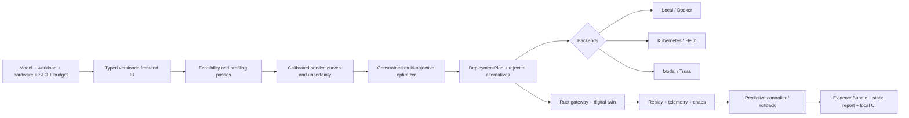

# SLOForge

SLOForge is an SLO-driven inference deployment compiler and adaptive runtime. It turns a typed model, workload, hardware catalog, price, profiling budget, and latency/goodput/availability constraints into a versioned `DeploymentPlan`, an uncertainty-aware Pareto frontier, deployable artifacts, and a hash-bound `EvidenceBundle`.

It is not an LLM proxy or a YAML generator. The compiler performs memory feasibility pruning, measured hardware and engine profiling, service-curve calibration, budgeted candidate search, topology/routing/admission/autoscaling lowering, deployment validation, replay, fault injection, and evidence-backed reporting. Modal and Baseten Truss are optional output targets; the local compiler, Rust simulator, and Rust gateway have no cloud dependency.

## Architecture



Python owns profiling orchestration, statistical models, optimization, control experiments, diagnosis, lowering, and reports. Rust owns the asynchronous streaming data plane, bounded telemetry, load generation, and deterministic discrete-event simulation. Their primary boundary is canonical JSON over a stable subprocess protocol: it is debuggable, language-neutral, and keeps a Python crash outside the latency-sensitive gateway process. See [Architecture](docs/ARCHITECTURE.md) and [ADR 0001](docs/adr/0001-rust-python-boundary.md).

## Three-minute CPU quickstart

Prerequisites are Python 3.11+, [uv](https://docs.astral.sh/uv/), Rust 1.93.1, and Node 22. Node is only used by the local artifact UI, but the full repository `bootstrap` and `check` targets include that UI. No NVIDIA GPU, model download, cloud account, or credentials are needed.

```console
make bootstrap
source .venv/bin/activate
make check
make demo
```

The demo starts three real Rust mock-server processes with distinct service curves, profiles them over HTTP/SSE, calibrates the digital twin, searches 540 configurations under a 24-trial budget, emits a plan and Pareto set, starts the real Rust gateway, replays 120 streaming requests, injects slowdown/crash/cold-start faults, evaluates guarded controller actions, and creates all five deployment targets.

The primary outputs are:

- `artifacts/demo/plans/qwen3-coding-agent.json`
- `artifacts/demo/evidence/evidence.json`
- `artifacts/demo/profiles/qwen3-cpu-mocks/measurements.jsonl`
- `artifacts/demo/simulator/replay.json` and `trace.json`
- `artifacts/demo/gateway/replay.json` and `metrics.prom`
- `artifacts/demo/benchmarks/serving-baselines.json`
- `reports/demo/evaluation.md`, `evaluation.html`, and `report-data.json`

The report generator first verifies every indexed SHA-256 digest and the plan's canonical digest. It refuses tampered input, so report values cannot drift away from the raw run silently.

## Cohesive CLI workflow

```console
sloforge trace validate workloads/coding-agent.jsonl
sloforge hardware probe --device cpu --output artifacts/hardware/local.json

sloforge profile \
  --model sloforge/mock-qwen3-0.6b-shape \
  --engines mock \
  --hardware artifacts/hardware/local.json \
  --trace workloads/coding-agent.jsonl \
  --budget-usd 0.20 \
  --output artifacts/profiles/local

sloforge optimize \
  --profile artifacts/profiles/local \
  --slo 'p95_ttft_ms<=250,p99_itl_ms<=45' \
  --objective minimize:cost_per_million_tokens \
  --output artifacts/plans/local.json

sloforge explain artifacts/plans/local.json
sloforge replay --plan artifacts/plans/local.json --trace workloads/coding-agent.jsonl
sloforge chaos --scenario scenarios/cpu-demo.yaml
sloforge export --plan artifacts/plans/local.json --target kubernetes --output generated/k8s
sloforge report \
  --evidence artifacts/demo/evidence \
  --artifact-index artifacts/demo/evidence/artifact-index.json \
  --output reports/local
```

An optimization result identifies the chosen non-dominated candidate, its fidelity (`measured` only for an exactly executed profile shape; otherwise `predicted`), uncertainty-adjusted constraint margins, the budgeted proposal history, and every rejected candidate with reason codes. `sloforge explain` names the dominant measured/modelled bottleneck and links back to evidence.

## GPU profiling

The default open-weight path is `Qwen/Qwen3-0.6B`, whose resolved immutable revision, safetensors checksum, parameter count, context limit, and Apache-2.0 license metadata are captured at profiling time. A CUDA probe never falls back to CPU and requires an explicit hourly price; zero is valid for owned hardware.

```console
uv sync --locked --extra dev --extra gpu-transformers
sloforge hardware probe \
  --device cuda \
  --hourly-price-usd 0 \
  --output artifacts/hardware/gpu.json

sloforge profile \
  --model Qwen/Qwen3-0.6B \
  --engines transformers,vllm,sglang \
  --hardware artifacts/hardware/gpu.json \
  --trace workloads/coding-agent.jsonl \
  --budget-usd "${SLOFORGE_GPU_BUDGET_USD:-0}" \
  --output artifacts/profiles/qwen3-gpu
```

Install the separate `gpu-vllm` and `gpu-sglang` extras in engine-compatible environments when those servers are requested. The Transformers path is the direct correctness baseline; vLLM and SGLang use managed OpenAI-compatible servers. TensorRT-LLM is isolated behind its optional adapter. Torch Perfetto traces, bounded server logs, package/CUDA metadata, and generated Nsight commands are retained. `make benchmark-gpu` records an explicit unavailable artifact rather than numbers when no NVIDIA device exists.

The Triton fused logits experiment is opt-in and never selected at runtime without a measured 10% benefit:

```console
uv run python benchmarks/gpu/benchmark_fused_logits.py \
  --device cuda --enable-triton-experiment \
  --output artifacts/gpu/fused-logits.json
```

## Gateway and controller

The Axum/Tokio gateway exposes OpenAI-compatible completion and chat paths with streaming SSE, bounded admission and stream buffers, cancellation propagation, pre-output-only retry, health checks, circuit breakers, four routing policies, structured errors, Prometheus metrics, and Chrome traces. Its contract suite covers partial output, malformed SSE, slow consumers, disconnects, saturation, retries, active health removal/restoration, and client-drop cancellation.

The controller records observations, drift forecast, all evaluated actions, safety guards, chosen action, canary state, observed outcome, and rollback reason. Minimum samples, hysteresis, cooldowns, and hourly change budgets prevent oscillation. A targeted test forces a materially different routing canary to violate promotion criteria and verifies rollback.

## Deployment targets

- Local and Docker: exact gateway config, cached model volume, explicit health checks, read-only/capability-dropped containers, and a Docker Compose smoke test.
- Kubernetes: Helm chart with gateway/backend Deployments and Services, probes, safe rollout, HPA stabilization, Prometheus annotations, optional GPU resources, security contexts, and a NetworkPolicy.
- Modal: offline-imported app pinned to Modal 1.5.3, current class concurrency/container/region/snapshot primitives, and engine-specific loading paths. SLOForge never calls `deploy`.
- Truss: engine-specific model bundle checked by Truss 0.18.24 and a vendored official-schema subset without Baseten credentials. This is community integration, not official Baseten support.

No exporter creates a paid resource. `SLOFORGE_GPU_BUDGET_USD` is the only authorization ceiling for optional paid experiments; absence means local-only execution.

## Verification and benchmarks

```console
make check          # Ruff, strict mypy, pytest/Hypothesis, fmt, clippy -D warnings, Rust tests, UI checks
make benchmark-cpu  # fresh CPU run plus repository-level evidence-derived report
make benchmark-gpu  # real path when available; explicit unavailable artifact otherwise
make docker-smoke   # Linux container build plus real streaming request
```

The checked CPU report is an integration and methodology study over explicit mock inference, not a claim about Qwen GPU performance. It preserves negative results: faulted simulator replay can miss the requested SLO, empirical interval coverage may be below nominal, and the predictive controller can cost more than the reactive baseline. H1 and production H2 remain unestablished until real multi-engine GPU trials are executed. The report's default/manual/compiled serving comparisons are visibly labeled calibrated predictions.

See [Reproducibility](docs/REPRODUCIBILITY.md), [Limitations](docs/LIMITATIONS.md), [Related work](docs/RELATED_WORK.md), and the [paper-style report](paper/SLOFORGE.md). The local artifact explorer is documented in [ui/README.md](ui/README.md).

## Security and scope

This research infrastructure does not implement authentication, billing, or tenant isolation. Bind the gateway privately or put it behind an authenticated ingress. Model code and weights are supply-chain inputs; the real profiler accepts safetensors, pins resolved revisions, and hashes snapshots. Generated cloud code must be reviewed before deployment. See [Security](docs/SECURITY.md).

SLOForge is distinct from KV-state transport systems, operation profilers, and provider-routing control planes: its core contribution is compiling and validating an inference deployment from workload, hardware, cost, uncertainty, and SLO constraints.

## License

SLOForge is Apache-2.0. Model weights, engines, generated base images, and cloud SDKs retain their own licenses; their versions and model license metadata are recorded in evidence.
