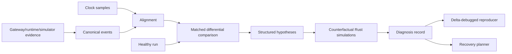

# SLOForge Autopsy architecture

Autopsy is a deterministic causal performance debugger. It answers what changed,
where delay first appeared, which resource and dependency propagated it, which
alternative explanations were contradicted, and which explicit repair best
closes the healthy-reference gap.

## Capture and normalization

`AutopsyRun` is the immutable capture unit. It binds events to topology,
physical-plan, and workload fingerprints and includes alignment estimates,
ground-truth fault intervals where available, evidence references, and warnings.

The implemented simulator capture converts every physical operation outcome to
a canonical event. It retains request, rank, resource, dependency, timing,
operation, and derived counters. The schema is intentionally broad enough for
gateway, scheduler, engine, NCCL, GPU, NIC, CPU, NUMA, container, and controller
adapters, but those privileged/hardware sources were not captured on the current
machine.

## Analysis pipeline

Time alignment transforms local monotonic timestamps with an explicit affine
offset/drift estimate and uncertainty. Differential analysis verifies compatible
topology, plan, and workload fingerprints, then matches stages by event type,
operation, rank, and request class. It reports count, median, relative deltas,
counter changes, first divergence, rank skew, and alignment sufficiency.

The diagnosis engine evaluates all 27 `BottleneckKind` rules. Each hypothesis
has a stable ID, typed target, supporting and contradicting evidence, confidence,
and rejection reason. It does not call a language model.

Counterfactual replay modifies a copy of the exact degraded Rust simulator input.
Removing faults, changing curves/rank rates, or replacing a resource yields a
new bounded simulation. The result reports improvement interval, remaining
healthy-reference gap, confidence, and status: supported, contradicted,
inconclusive, or simulation failed.

Minimal reproduction uses deterministic delta debugging over ranks, events, and
counters. Event dependencies to removed events are repaired and the diagnosis
predicate is evaluated on a fully validated run after every reduction.

## Evidence from the flagship demo

The synthetic degraded run contains 768 canonical events in
`artifacts/fabric-demo/autopsy/degraded-run.json`. The diagnosis in
`artifacts/fabric-demo/autopsy/diagnosis.json` ranked `rank_straggler` first at
demo-level confidence 0.90 and recorded the first divergence at 176,000 ns.
Seven repairs were evaluated; `remove-both-faults` restored the healthy simulated
reference. These are deterministic synthetic results, not measured multi-node
diagnosis accuracy.

The same artifact exposes current multi-fault ambiguity: network bandwidth
degradation was a ground-truth fault, but its direct threshold rule was
contradicted in the aggregate comparison and did not enter the top three. The
combined counterfactual nevertheless showed it was needed for full restoration.
This is reported as a limitation, not relabeled as a correct top-1 diagnosis.

