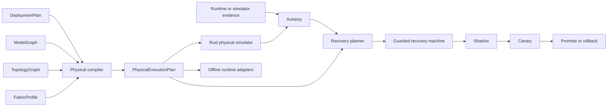

# SLOForge Fabric architecture

SLOForge Fabric is the physical compilation and recovery layer above SLOForge's
logical `DeploymentPlan`. It does not replace the gateway, logical optimizer, or
runtime engines. It binds a logical plan to an observed topology, calibrated
service curves, a model graph, and a workload, then emits an auditable
`PhysicalExecutionPlan`.

## Component boundaries

Python owns discovery orchestration, profile normalization, model inspection,
physical candidate generation, diagnosis, recovery policy, deployment lowering,
ForgeCI, WarmPath, and reports. Rust owns deterministic physical-resource
scheduling. The boundary is bounded, versioned JSON over subprocess
stdin/stdout; the Fabric simulator schema is `1.0`. This reuses SLOForge's
existing process boundary and avoids a second RPC control plane.

The canonical physical IR is implemented in
`python/sloforge/fabric/ir/` and `crates/sloforge-fabric-protocol/`. Core models
are strict and immutable. Unknown fields are rejected except through the
validated, namespace-qualified extension mechanism inherited from the logical
IR. Canonical JSON and SHA-256 content hashes bind a plan to its topology,
profile, model graph, environment, and logical plan.

Topology discovery has two representations. `DiscoveryTopologyGraph` preserves
individual observations, unknowns, conflicts, commands, and source confidence.
`TopologyGraph` is the compiler-facing graph. Conversion refuses unresolved
facts needed for a typed canonical node rather than inventing a capability.

The profile layer separates explicitly synthetic calibration from measured
host data. Synthetic fixtures cover GPU, collective, expert-dispatch, KV, and
startup shapes in CPU CI. The current-host measured path implements bounded
host-memory copies. Optional GPU/transport adapters advertise availability and
commands; they never silently substitute CPU execution.

The compiler enumerates parallelism and disaggregation candidates, applies
memory/runtime/topology/SLO feasibility rules, places ranks, selects paths, and
calculates an inspectable robust objective. It emits the Pareto set, every
rejection, failure exposure, and three recovery variants when enough feasible
alternatives exist. Analytical ranking is intentionally distinct from the Rust
validation pass. The compiler records zero simulator calls because it does not
pretend candidate scoring was discrete-event simulation.

The Rust simulator schedules a dependency graph on exclusive or fair-share
resources. It models CPU launch groups, GPU compute/HBM/copy engines, NVLink,
NVSwitch, PCIe, NIC queues, network rails, storage paths, sharing domains,
collectives, expert exchange, KV transfer, faults, and counterfactual resource
changes. Every service curve includes measured, synthetic, or analytical
provenance.

Autopsy normalizes simulator or runtime events, estimates clock offset and drift,
matches comparable stages, derives causal signals, and ranks 27 typed hypotheses.
Counterfactuals change the exact degraded simulation input and execute the Rust
simulator. Diagnosis never depends on a language model.

Recovery maps the diagnosis and compiled recovery variants into typed actions.
The state machine requires simulation validation and then advances through
building, shadow, canary, promotion, and graceful drain. Observations and action
attempts are idempotent and persist in a bounded audit log. External mutation is
disabled unless both policy and executor authorize it.

## Data and control flow

1. Discover a host or load an explicit topology fixture.
2. Benchmark that exact topology and bind the profile to its canonical hash.
3. Inspect a local model config or construct the labeled synthetic MoE graph.
4. Compile the logical plan into a physical plan.
5. Validate the plan with the Rust simulator and replay workload shapes.
6. Capture canonical events and compare a healthy and degraded run.
7. Evaluate explicit causal repairs with counterfactual simulation.
8. Plan and execute recovery through the guarded state machine.
9. Lower the plan to local, Docker, Kubernetes, Dynamo, Modal, or Truss
   artifacts without deploying anything.

## Failure handling

All subprocesses are bounded by size and timeout. Invalid plans fail validation;
unreachable paths are not assigned a default transport. Unknown topology facts
remain unknown. Inconclusive counterfactuals are preserved instead of promoted.
Recovery timeouts become `ABORTED`, `ROLLED_BACK`, or `OPERATOR_REQUIRED`
depending on whether traffic moved and whether active streams remain. Started
streams are never retried by the recovery layer.

## Demonstrated scope

`artifacts/fabric-demo/manifest.json` is a deterministic synthetic two-host,
16-rank run. It records two injected faults, seven counterfactuals, and a
completed recovery. It is not GPU or network measurement. Hardware discovery
works on the current Apple Silicon host, while NVIDIA, NCCL, RDMA, and multi-node
runtime execution remain unexercised on this machine.

