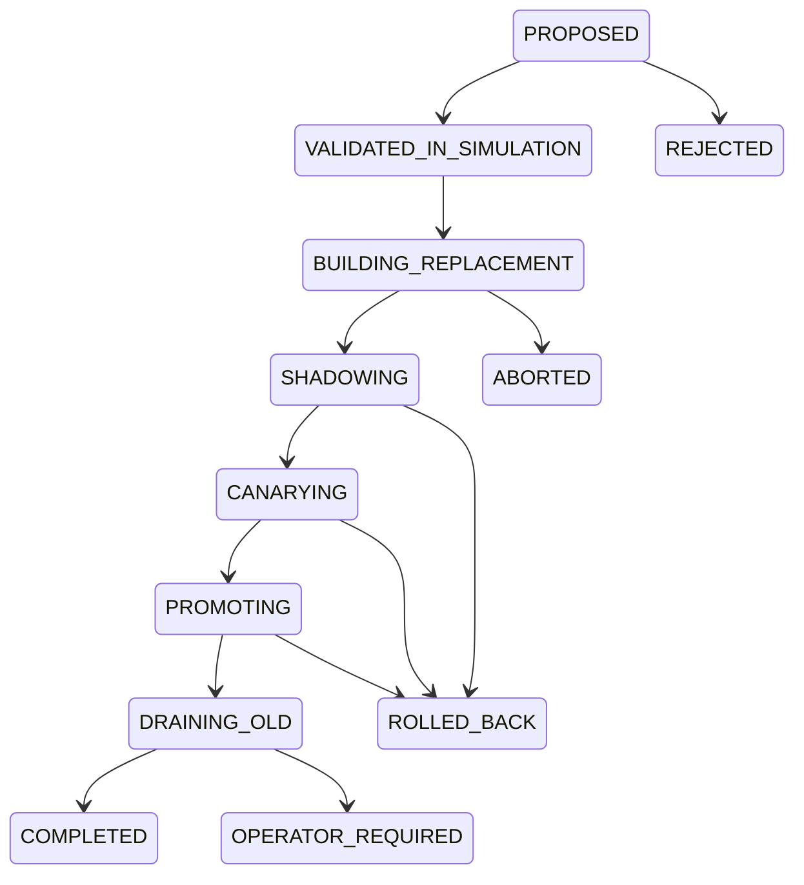

# Recovery state machine

The recovery state machine persists a `RecoverySnapshot` and advances only on a
typed `RecoveryObservation`.

`PROPOSED` checks confidence, external authorization, and counterfactual
validation. Building records each action attempt exactly once by action ID and
idempotency key. Shadow and canary require readiness, no failed action, minimum
samples, and all promotion metrics. Promotion changes traffic; drain waits until
no started streams remain. Completion begins cooldown.

Rollback criteria are evaluated during shadow, canary, and promotion. Abort
criteria apply globally. State and total deadlines yield `ABORTED` before traffic
movement, `ROLLED_BACK` after canary/promotion, or `OPERATOR_REQUIRED` if a drain
deadline expires with active streams.

`ROLLED_BACK` is a persisted controller/traffic state. The simulated executor
does not execute a general inverse action for every `rollback_action_id`, so it
must not be described as automated infrastructure undo for an external driver.

Duplicate observation idempotency keys return the unchanged snapshot. Observation
times must be monotonic. Snapshot plan hash must equal the active recovery plan,
which supports controller restart without replaying side effects. Audit records
contain sequence, before/after state, reason, idempotency key, timestamp, and
typed fields and are bounded by configuration.

The deterministic flagship execution reached `COMPLETED` with 12 audit records;
the exact snapshot and action attempts are in
`artifacts/fabric-demo/recovery/execution.json`.
