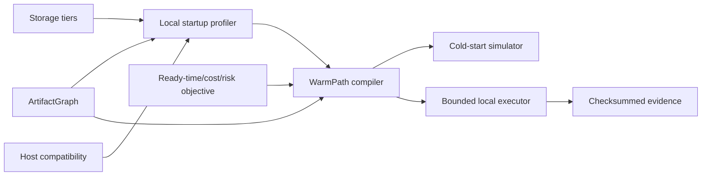

# WarmPath architecture

WarmPath compiles model-startup artifacts onto storage and memory tiers. It is a
portable local reference planner, not a cloud snapshot runtime.

The strict `ArtifactGraph` describes artifact dependencies, content hash, bytes,
source path, compatibility, security class, and whether lazy materialization is
allowed. `StartupProfile` binds measurements and storage tiers to an exact host
fingerprint. `WarmPathPlan` binds graph/profile hashes, selected placement and
mode, stage predictions, uncertainty, cost, failure probability, optimizer trace,
rejections, and evidence.

The local profiler times bounded file read, checksum verification, and memory
copy stages with warmup separation and environment capture. The cold-start
simulator schedules dependencies and transfer/verify/restore work for seeded
trials. The planner evaluates capacity, compatibility, security, startup SLO,
cost, and failure risk.

The executor supports local NVMe, page cache, and host memory. It validates path
containment, byte size, SHA-256, tier capacity, timeouts, and host/graph hashes;
uses atomic files; and performs deterministic LRU eviction. Unsupported remote
tiers fail instead of silently using local disk.

The current demo uses deterministic mock snapshot files and measured local file
operations. It does not capture or restore GPU HBM or provider-private process
state.

