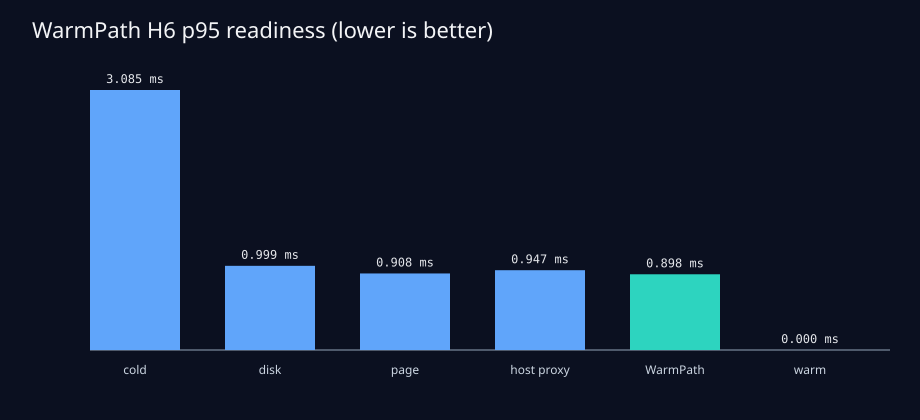

# WarmPath H6 evaluation

This CPU-only comparison resamples measured local startup stages across 11 deterministic seeds. It evaluates 1111 trials per strategy and scenario. P95 intervals are bootstrap intervals over per-seed p95 values.

| Strategy | p50 ready (ms) | p95 ready (ms) | 95% CI of seed p95 (ms) | Hourly cost (USD) | Failure rate | Eviction p95 (ms) |
|---|---:|---:|---:|---:|---:|---:|
| cold_uncached | 2.9226 | 3.0850 | [3.0849, 3.0850] | 0.000002 | 2.97% | 3.0850 |
| local_disk_cache | 0.8217 | 0.9987 | [0.9878, 1.0032] | 0.000002 | 3.60% | 0.9989 |
| page_cache | 0.7270 | 0.9082 | [0.9069, 0.9092] | 0.000000 | 2.88% | 0.9338 |
| pinned_host_memory_modeled | 0.7663 | 0.9467 | [0.9414, 0.9468] | 0.000010 | 2.70% | 0.9415 |
| warmpath | 0.7151 | 0.8984 | [0.8976, 0.8993] | 0.000000 | 3.33% | 0.9438 |
| warm_replica | 0.0000 | 0.0000 | [0.0000, 0.0000] | 0.420000 | 0.18% | 2.9929 |

## Findings

- WarmPath changed p95 readiness by +10.04% relative to the local-disk baseline (positive means faster).
- The best non-warm strategy was `page_cache`; WarmPath changed p95 by +1.08% relative to it.
- Under the configured eviction pressure, WarmPath p95 changed by +0.0453 ms.

## Measurement basis and limitations

- `cold_uncached`: declared-tier-bandwidth-floor plus bootstrapped measured checksum verification.
- `local_disk_cache`: bootstrapped measured local-NVMe fetch and verification.
- `page_cache`: bootstrapped measured page-cache fetch and verification.
- `pinned_host_memory_modeled`: bootstrapped measured host-memory copy used as a pinned-memory proxy.
- `warmpath`: compiled WarmPath placements with bootstrapped measured stages.
- `warm_replica`: modeled already-ready replica with declared hourly cost.

- The workload uses a small deterministic synthetic snapshot, not production model weights.
- Pinned host memory is a modeled proxy backed by measured ordinary host-memory copies.
- Cold-cache behavior is a conservative bandwidth-floor model because unprivileged portable cache eviction is unavailable.
- Failure and eviction probabilities are controlled sensitivity scenarios, not observed host failure rates.
- Warm-replica readiness and cost are modeled; no cloud or GPU resource was created.

Every table value is loaded from `artifacts/warmpath/evaluation/result.json`; individual trial outcomes are preserved in `artifacts/warmpath/evaluation/raw/trials.jsonl`.
